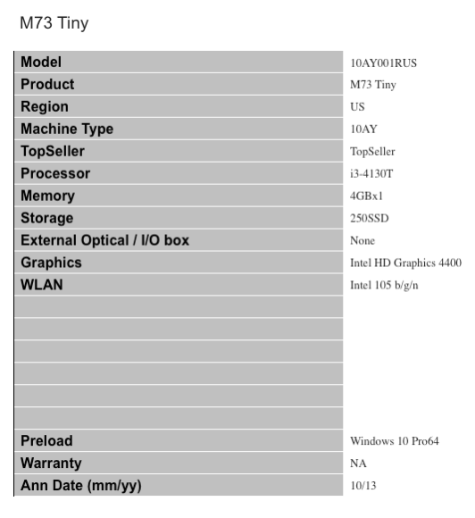
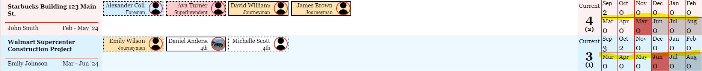
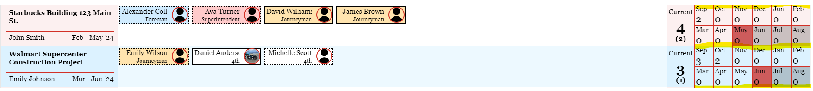
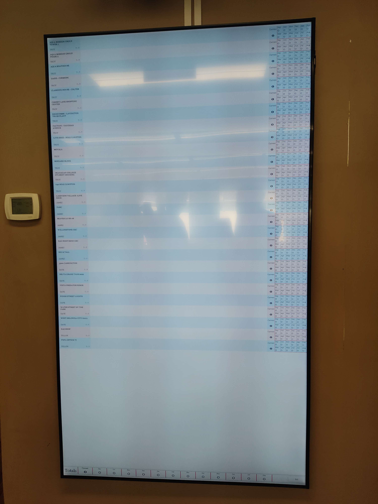
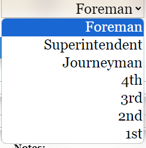

The home for you communications log. 

Please refer the "UBCO Capstone Summer 2023 - Communication Log.pdf" in the same folder!!!!

## Tue, May 23

### type: email

### note: Initial contact with client

### description: Confirmed first client meeting in-person on May 29 (Mon) between 11:00 and 4:00 on site at 1136 Richter St.

I would like to create a manpower/scheduling board.
 
Client:   Horizon Electric Inc.
 
Background:       Horizon Electric is a local Electrical Contractor – employing 100+ employees. 
 
Project description:         Detailed manpower scheduling is required in the construction industry to maintain productiveness on all projects.  The goal is to produce a manageable chart to maintain and provide outlook for future manpower requirements.
 
 
Currently we are using dry erase board and magnets.  (see attached)
 
Column #1           Jobs under construction or upcoming
Column #2           Project Manager
Column #3          space for employee names ( movable – so we can drag and move them around)
                                Space for subcontractors
Column #4-16    12 months – totalling the employees on site(s)

The attached white board picture can also be found in the from client folder

## Mon, May 29

### type: in-person

### note: First client meeting

### description: Meeting at client business

First meeting. Confirmed requirement and scheduled meetings on every second Wednesdays 11:30 am over Microsoft team. Got Microsoft Team invitation from James. Went over the question brainstorm part 1.

## Mon, May 29

### type: email

### note: Follow-up after first meeting

### description: Client sent attachment

Sample excels and detailed white board picture.
In excel:
‘We should have another row for “Housing” along with “School and Vacation”’
3 attachments can be found in the from client folder

## Thu, Jun 01

### type: email

### note: Client sent their logos

### description: 2 attachments

2 attachments can be found in the from client folder

## Fri, Jun 02

### type: email

### note: Initial draft of edit view

### description: Sent to client

1 attachment sent to client (see the from client -> to client folder)
The following is the client’s response:
“That is a great start.  We should change the orientation to portrait not landscape.  To fit the wall better – more length.”

## Tue, Jun 06

### type: email

### note: Design + reschedule bi-monthly meeting time

### description: Sent Figma link + reschedule meeting starting 30 minutes earlier

The design link is as follow:
https://www.figma.com/proto/h1jFFwPBHSjqKE72JzIevY/Horizon-Electric?type=design&node-id=4-251&scaling=scale-down&page-id=0%3A1&starting-point-node-id=4%3A251
No comment on the design yet.
Agreed to change meeting time 30 minutes earlier for the future meetings, including tomorrow’s, which is every other Wednesday starting 11 am.

## Wed, Jun 07

### type: Over Microsoft Team

### note: Second client meeting

### description: Discuss design mock-up + question brainstorm part 2

Happy with the design for now. Discussed about question brainstorm part, ex: projector limitation/resolution.

## Tue, Jun 20

### type: email

### note: Tomorrow’s meeting reminder + quick question about excel

### description: Excel columns question regarding start date, end date, and job status

Asked whether:
prefer to keep your Excel file as it is (we will leave the start date, end date, and job status fields empty for you to fill in manually later) or if you would like to add three columns specifically for these: start date, end date, and project status on your Excel?

No reply. Will ask early tomorrow’s meeting again (mainly for the reminder).

## Wed, Jun 21

### type: email

### note: meeting reminder

### description: 3 emails total before the meeting

First email to check whether everything stay unchanged (cc to James and Troy)
Second email is reply and said yes from Dave.
Third email is a quick thank you and see you later.

## Wed, Jun 21

### type: Over Microsoft Team

### note: Third client meeting

### description: Showed progress + ask brainstorm part 3 + projector/tv/wall size/dimension

Asked question brainstorm part 3, ex: csv column.

Below is the quick note taken during the meeting:
Reason for archived (add note section)
Initial password: Note: not answer (maybe not interest)
Projector: not decided yet tv or projector, 45 horizontal 90inch tv, 80 by45 
5feet wide 8feet tall wall

## Wed, Jun 21

### type: email

### note: Follow up after client meeting

### description: Got an updated employee list excel

1 attachment can be found in the from client folder

## Fri, Jun 23

### type: email

### note: Display TV decision email

### description: Got an attached file

1 attachment can be found in the from client folder
The following is quoted from email:
Will be installed in portrait mode.
We have 41.5” x 72” of usable screen space
 
https://displaysolutions.samsung.com/digital-signage/detail/2040/QE85T

## Tue, Jul 4

### type: email

### note: Reschedule tomorrow’s client meeting to 1pm

### description: The client agreed

There are 3 emails total + 1 email with new Microsoft Teams invitation.

## Wed, Jul 5

### type: Over Microsoft Team

### note: Fourth client meeting

### description: The client tested on Jordan’s server and discussed deployment

The client used the following to test during the meeting:
URL: http://www.jordorob.ca/src/login.php
Username: johnsmith
Password: password123
Emphasized that the availability is depends on Jordan’s computer.
Discussed deployment plan.

## Wed, Jul 5

### type: email

### note: Follow-up meeting

### description: Sent the URL and login credentials they used

The URL and login credentials are mentioned in last log.

## Fri, Jul 7

### type: email

### note: Received an email cc to his colleague and Next Generation Computers

### description: Asked information/specifics they need to know about deployment

The following is quoted from James’s email:
Hi guys, 
 
If I have miss anyone please feel free to add them. 
 
Horizons network/server IT team (Next Generation Computers) needs to know a few key details on the web based, locally hosted program for our server. 
 
Please replay all with the necessary information needed to implement this program on our system.  
 
Next Generation Computers wants to know what the back end of the program, is it SQL or something else. 
 
If there are any specifics you need to ask please let us know as well. 
 
I have included the Link that works when Jordan’s computer is on for viewing. 
 
Hi Dave,
 
This is a quick follow-up email. I wanted to provide you with the necessary information from our meeting. Below are the URL and login credentials you used:
 
URL: http://www.jordorob.ca/src/login.php
Username: johnsmith
Password: password123

## Wed, Jul 12

### type: email

### note: Reply email from Fri, July 7

### description: Talked IT needed and deployment timeline

For the IT team, told them Docker and GitHub account are must, also told them the project is developed using PHP and MySQL (PDO library). Provided architecture diagram.
For the managers, told them that the project will be isolated and so don't worry about it possibly messing with other stuff on the server.
Deployment timeline: mentioned Aug 9(Wed) works the best for us. Mentioned our timeline/plan for Aug 2(regular meeting, client test), Aug 4(class event, receive and incorporate feedback), Aug 9(schedule an in-person meeting, wishing their IT team will be present), and the week of Aug 13th(final presentation week, but date to be announced)
Also told them will provide a deployment manual once ready.
 
There are 2 attachments sent to them, architecture diagram and calendar/timeline.

## Wed, Jul 12

### type: email

### note: Received response from Martin

### description: Asked to setup a quick call

Martin Wengenmeier: IT contractor

## Thu, Jul 13

### type: email

### note: Received response from James

### description: Answer to Martin’s previous email

The following is quoted from email:
I have reached out to NGIT and will advise when they are ready to work with you and the team.

## Thu, Jul 13

### type: email

### note: Reply to James

### description: Tell him that we will wait for the update

Tell him that we will wait for the update

## Mon, Jul 17

### type: email

### note: Email from James

### description: Provide help to schedule meeting

James provided help to host a Microsoft Teams call meeting, preferably between 8:30am and 3:30pm Monday to Friday, to let us (UBC student team) and IT contractor (Next Generation Computers) connect.

## Mon, Jul 17

### type: email

### note: Email to James

### description: Propose a time to schedule a meeting

Proposed to have a meeting tomorrow (Tuesday) 2pm and let them know that the whole team won’t be there

## Mon, Jul 17

### type: email

### note: Martin replied

### description: Asked for just a short call

The following is quoted from the email:
Would you have just a min to chat? I don’t need to include James or the rest of your team, just have a few simply questions.

## Mon, Jul 17

### type: Phone call

### note: Yuan and Martin

### description: Opened discorded voice channel for team members to hear but unfortunately not able to hear others in the discord voice channel

Asked whether we are able to provide support in long term and whether we are going to provide device.
Scheduled a virtual meeting tomorrow (July 18) at 11am

## Mon, Jul 17

### type: email

### note: Martin replied to James

### description: Asked for help to setup a meeting for tomorrow

The following is quoted from the email:
I just spoke with Yuan, any chance we can do 11am tomorrow instead? I believe she was ok with this time, and it works for me as well.

## Mon, Jul 17

### type: email

### note: James sent meeting invitation email

### description: Meeting at 11am July 18, 2023

This invitation is forwarded to Adam (on July 17, 2023) and Edwin (on July 18, 2023)

## Tue, Jul 18

### type: Over Microsoft Team

### note: IT: Martin; HE: James and Dave; UBC student team: Yuan, Edwin, and Adam

### description: Discussed deployment + short demo to IT

Asked to record meeting to show other team members who aren’t able to make it.
Cancelled tomorrow’s client meeting (July 19 one).
Confirmed the added in-person meeting on August 9 (1PM – 1:30 PM)

## Tue, Jul 18

### type: email

### note: This is a summary for few emails

### description: Invitation email + recording

Thank you email for the recording sent, and recording is forwarded to all other team members.
Recording link: https://horizonelectricnet-my.sharepoint.com/personal/dave_horizonelectric_net/_layouts/15/stream.aspx?id=%2Fpersonal%2Fdave%5Fhorizonelectric%5Fnet%2FDocuments%2FRecordings%2FCapstone%20%2D%20IT%20protocol%2D20230718%5F110229%2DMeeting%20Recording%2Emp4&ga=1

Received cancellation invitation email (July 19, Microsoft Teams) + new invitation email (August 9, in-person)

## Thu, Jul 20

### type: email

### note: Adam sent the email

### description: potential issues by deploying the website on a computer

To martin, discuss some potential issues by deploying the website on a computer.
The following is quoted from email:
1. Our software periodically saves backups of the database, which would not be performed during the time the computer is off.
2. What's more concerning is security, as essentially anyone that has access to the computer will have essentially full access to the database, which will contain, as far as I was told, sensitive information (passwords will be hashed of course, but they can basically modify/delete anything, including the accounts, employee & job info, and backups we store). We can limit the permissions on our server, but I don't believe there is anything we can do to stop someone from simply reconfiguring the permissions and restarting the server

## Thu, Jul 20

### type: email

### note: Martin replied

### description: Offered another option

Martin offered to run on a virtual machine hosted on Hyper-V server

## Tue, Jul 25

### type: email

### note: Adam replied

### description: Discussed issues if run the system on a virtual machine

Discussed issues if run the system on a virtual machine. The following is quoted from email:
1. Our system does not require many of the services of an operating system, so a full-blown virtual machine would be a waste of server resources compared to a container.

2. Our system would still require being run on docker. Thus, if we do put it on a virtual machine, we would have our server running on a docker container running within that virtual machine, which is almost equivalent to a virtual machine within a virtual machine. This would probably have multiple issues, including extra performance costs, server resources used, and configuration required.

## Sat, Jul 29

### type: email

### note: Adam replied

### description: Quick update after discussing with the professor, Scott

On a virtual machine is fine. Also let Martin know that Scott suggested that make it a Linux virtual machine instead of a Windows one (possibly save some hassle with licencing)

## Mon, Jul 31

### type: email

### note: James replied

### description: Let us know that he will speak with Martin NGIT

The following is quoted from the email:
I will speak with Martin NGIT, before this Wednesdays meeting and let everyone know.

## Mon, Jul 31

### type: email

### note: Martin replied

### description: Sent the details of the laptop

The following is quoted from the email:
I also willing to donate an older pc, it has win10 currently, but you can install al Linux distro and docker as you prefer. I can provide the network IP Info for you to set the machine to.  I’ll chat with James later today ….

## Wed, Aug 2

### type: Over Microsoft Team

### note: Last meeting before deployment

### description: Tried edit view on the tv and discussed minor layout issues

Layout issues to fix:
Tiny line on the screen, cut at the bottom of the screen (see below).

Talked about what they need for the deployment + time estimation (1h if everything goes smoothly, 2-2.5h if there is any issue)
Talked about the templated used for import csv.

## Wed, Aug 2

### type: email

### note: Follow-up after the client meeting

### description: This is a summary of three emails

Yuan sent the employee list + job list excels templated used for implementation.
Dave sent the updated employee list + job list excels
Thank you email sent.
4 attachments can be found in the from client folder and the to client folder.

## Wed, Aug 2

### type: email

### note: Follow-up email from Dillon

### description: Style change request

Dillon emailed to double-check the format of excel sheet (both job and employing) by sending their current updated excel.
He also requested a minor style change of projection numbers.
The following is quoted from email:
Regarding 1 change we would like, since playing around today.
The monthly projections on the right hand side per job, can we move the horizontal red lines up 1 space.  As it sits now the red horizontal line splits the job row in half, whereas we would like the red outline to box in that jobs projections.
Current

Requested Change – Move red lines to highlighted spot

## Wed, Aug 2

### type: email

### note: Confirm email

### description: Confirm that the style change request is received and the format of excel needed

Confirm that layout change request will pass to the team.

## Wed, Aug 2

### type: email

### note: Options for style change from Dillon

### description: 4 options

4 options and provided them as attachments (showing only the projection numbers part and the entire screen, also one picture shown all 4 together)
1 attachment folder (has 9 images) can be found in the to client folder.

## Thu, Aug 3

### type: email

### note: Follow-up email for the 4 options

### description: Clarify colours, transparency, and opacity are easy to change, those 4 are styles

Clarify that the 4 options from the previous email are just the style; colours, transparency, and opacity are easy to tweak. Asking for their preference. Also send an example image of option 1.
1 attachment can be found in the to client folder.

## Thu, Aug 3

### type: email

### note: Style chosen from the client

### description: This is a summary of 4 emails

Email 1:
Dave is fine with whatever we choose.
Email 2:
James emailed that they had a quick chat, and they chose the option 1, bold with lines.
Email 3:
Thank you email from Yuan.
Email 4:
Quick “like react” from James.

## Tue, Aug 8

### type: email

### note: Parking request

### description: Prior in-office deployment email

Ask that Martin (NGIT) to be in-person for the deployment on Aug 9. Also asked for parking request in front of their office.

## Tue, Aug 8

### type: email

### note: Okay to park in front of their office; Martin is available remotely

### description: Dave replied

The following is quoted from email:
Martin is available remotely.  There is lots of parking around, if there are spots empty in front feel free to use them.

## Wed, Aug 9

### type: email

### note: Yuan replied from personal email

### description: Thank you email

A simple 2-sentence thank you email.

## Wed, Aug 9

### type: email

### note: James provided additional parking info

### description: More parking info

The following is quoted from email:
If there is space yes parking feel free too park out front, if not just across the street or on Vaugh ave usually has lots. If anyone needs Ebike or Scooter power let us know too, we can accommodate this.

## Wed, Aug 9

### type: email

### note: Quick thank you

### description: Thank you email

A simple 2-sentence thank you email.

## Wed, Aug 9

### type: In-office

### note: deployment

### description: From 1pm-4:30pm

Successfully deployed on their machines. Created a syn button for new updates from us.
Adam invited them to attend our final presentation on Aug 17, 2023.
Issues:
1:
There are not following the format of the excel they sent (multiple phone number in the same cell for phone number, like up to 8 numbers in the same cell); we solved by editing function so that the third phone numbers and more will be added to the note section for that employee.
2:
There are not following the format of the excel they sent (3 lines of header and 3 lines of footer for employee list), which results in the break of the function -> there are a couple employees are not imported, we solved by manually added by using “add employee” feature.

Last, took a photo of how the TV display their scheduling (see below)

## Thu, Aug 10

### type: email

### note: Instruction of how to sync + task list to guide system + sus questionnaire

### description: Adam sent the email

The following is quoted from email:
So, now that we got the scheduler successfully deployed on your machines, we have since then made some updates and added a help page that has some gifs of how to do most of the major actions on the website. It is still a little unfinished, and we are currently working on making the help page easier for you guys to use (amongst other new features and polishing), but I figured that it would be best for you guys to have something to fall back on while you all learn the new system. 

However, I will need one of you to sync the project to get the new changes, which we made fairly easy to do. On the computer running our server, go to the desktop and you will see a "sync project" file that we created (I forget exactly how it's named). All you need to do is run it (i.e. double click) and that's it.

Also, there's one last thing. We have basically a task list of all the features we would like you to try out on the system attached below, as well as a user experience survey linked herefor your feedback once you are done with the task list (the feedback is for including in our final presentation/report). Ideally, I think that everyone that would be using the system should go through the task list and do the survey; mostly because client feedback is really important (and that we can still make changes), but also since the task list sorta acts as a guide for learning the system. 

That's all. I hope you all have a great day trying out the new system! If you have any questions, please don't hesitate to ask!

Link is here if broken in the above: https://docs.google.com/forms/d/e/1FAIpQLSdK5-skg8KF50FsdlDGn7bCHK6G4PFHw6pDXh6poyxZr9Aicg/viewform
The task list to guide system can be found in the to client folder.

## Thu, Aug 10

### type: email

### note: Correction on how to sync

### description: Adam sent the email

The following is quoted from email:
Correction: The "sync project" file is within the student project folder that is on the desktop

## Thu, Aug 10

### type: email

### note: Confirmation email

### description: Replied from Dillon

Confirm that he successfully synced, and they are all testing

## Fri, Aug 11

### type: email

### note: Follow-up from Dillon

### description: Feedback

Minor issues and a couple of adjustments request. The following is quoted from email:
Following up with some feedback.  We populated the board yesterday and have been using it extensively since.  The project has exceeded our expectations and will be an asset to our office.  I did run into minor issues with the batch assign tool, see attached word document.
 
There are a couple of adjustments and adds that we have compiled.  Let us know what you think and if they are doable.  Please reach out if anything needs more discussion or clarification.
 
1.	Inside the Employee card:
- Rename “Phone Number” to “Personal Number”
- Rename “Secondary” to “Horizon Number”
 
2.	Add to the employee level tags drop down list(Journeyman, 4th, 3rd etc)
- Project Manager
- Safety Coordinator

3. Add the ability to search for employee names while on the job window.
 
4.	Add the ability to change font type, size, bold.  Some of the smaller text on the tv gets blocky and pixelated with the current font.  We would like to try a Calibri or Ariel font.  
 
5.	On the main job screen, there are employee tiles where the name is longer then the tile size.  When we hover our mouse over the employee tile the name scrolls.  Can we change it so that any names that are longer then the tile allows to constantly scroll, not just on mouse hover?
 
6.	We have found that we want the Inactive and School Lists to be shown on the jobs screen.  What we did was create jobs called “Inactive” and “school” and assign the employees to it, which is working great.  The issue is that we would also like them to be populated in the employees tab, but they cannot be inactive and on a job at the same time. Also with keeping with the theory and function that when an employee goes to school or goes in active they are removed from the job for that duration.
The doc file (about batch assign) can be found in the from client folder.

## Fri, Aug 11

### type: email

### note: Explain the requests.

### description: Adam explained

The following is quoted from email:
I'm glad you are enjoying the new system!

For the feedback, most of those we should be able to do just fine (we actually just fixed the issues with the batch assign and they will be merged in soon):

1.  Very Easy.

2. Now with this one, unfortunately with the way it's programmed, there's not a super easy option: We can simply add the roles to the end of the list, though this will mean they will show up last when showing the lists of employee cards on jobs and on the employee page (i.e. it'll list the employees with Foremen first, then superintendent, ..., 3rd, 2nd, 1st, Project Manager, Safety Coordinator), which might not be super visually appealing. The other (probably better) option is to essentially shift all the employees' roles over to be Project Manager, Safety Coordinator, Foremen, etc.. (feel free to correct the order here), which will look nicer, though it will require that we do a remote-desktop meeting so we can go into the database to shift all of the current employees' roles over. 

3. This should also be fairly easy.

4. Unfortunately, this one might be really hard to do. The easiest option for us is to remote-desktop in and adjust the font type, size, and bold while you guys inspect it until it looks good.

5. This was surprisingly difficult to do, but Edwin managed to make it work. Though, he found that all the employee names moving were distracting while moving the employees around, so he gave it only to the projector view. This can be changed though, if you would like.

6. This one is a bit harder but should absolutely be doable. Though, depending on how we do this, this one might also need us to do a remote-desktop thing to adjust the database.

I will keep you posted once we have more changes for you to sync in!

## Mon, Aug 14

### type: email

### note: Clarification of the explanation from Adam

### description: Dillon replied

The following is quoted from email:
We can setup a remote connection whenever works for you, let me know and I can get you the login information.  We use teamviewer for remote access, you will need to download the client and create an account for remote control.  
 
1.	Great
2.	Having Project Manager and Safety Coordinator at the end of the list is fine.  Having them stand out and not be mixed in with the other employees is almost ideal even.
3.	Great
4.	That is fine, we do not need the option to change font whenever we want.  Set it to something a bit more legible and leave it be.
5.	Auto-scrolling is not a must have, more of a quality of life thing, and also in my mind help reduce any potential burn in on the screen.  If it is something we could demo like the font changes that would be great, if not and we risk having other issues arise because of it then no worries.
6.	Great

## Mon, Aug 14

### type: email

### note: Reply for Dillon’s reply

### description: Adam replied

The following is quoted from email:
Wonderful! If we can get a teamviewer session set up tomorrow sometime, that would be perfect!

Also, I should probably mention that technically tomorrow is the last day to make changes to the project, though the course does not actually end until Thursday (for our final presentation). 

And there's one last thing that we would just like to clarify. For fixing having inactive and in-school more visible, would you like it so that it is shown on just the projector view? Or were you preferring to have an interactive version on the job page as well? Asking this since just displaying them on the projector view is easy for us to do, though it will require a lot more effort to also add it onto the job page with a way to drag-drop onto them.

## Mon, Aug 14

### type: email

### note: Quick reply to provide contact information

### description: Dillon replied

Tells that he is in the office all day and provide his cell number

## Mon, Aug 14

### type: phone

### note: Clarification of the client requested changes

### description: Edwin called

Made clear what the clients need on their requested changes.

## Mon, Aug 14

### type: email

### note: Change to Calibri

### description: Email from Dillon

Change to Calibri font.

## Mon, Aug 15

### type: email

### note: Explain the requests.

### description: Adam replied

Tells them that they can sync. The following is quoted from email:
Okay so we just got finished with a lot of the new changes, so you should now be able to sync the project to get them! 

If the new font does not work out, feel free to throw me an email and we can set up teamviewer.

## Mon, Aug 15

### type: email

### note: Confirmation that they will sync

### description: Dillon replied

They will sync.

## Mon, Aug 15

### type: email

### note: Ask how’s looking

### description: Adam’s follow-up

The following is quoted from email:
How's it looking?

Also I should probably clarify that the teamviewer meeting would just be to rapidly try out a bunch of different text styles until we come across one that looks good on the TV

## Mon, Aug 15

### type: email

### note: Describe how the new changes go

### description: Dillon emailed

The following is quoted from email:
All went great on the TV, sync ran no issues.  All changes were there and tested working.
 
Had issues with all of our client machines not seeing the updates.  The solution we found was to do a full refresh (ctrl+f5) of the website, one machine required 3 refresh cycles to see the changes.
 
I have tested the features and they all look and work great.  The consensus among us left in the office today is the new font is much better.
 
Can confirm the issues with batch assign are corrected.

## Mon, Aug 15

### type: email

### note: Explained what happen if there are more bugs/requested changes

### description: Adam emailed

The following is quoted from email:
Ay that's awesome! We're glad to hear that!

If any of you come across any more bugs or things to change tomorrow, feel free to let us know. If they're easy/critical fixes we can make them right away, any bigger changes we'll make note of in our final documentation for future people working on the project.

We're currently just finishing the documentation, and hopefully by tomorrow or Thursday we will email you to have you sync one last time to get the new documentation. 

That's all, hope you have a great day!

Please refer the "UBCO Capstone Summer 2023 - Communication Log.pdf" in the same folder for the reset of it!!!!

