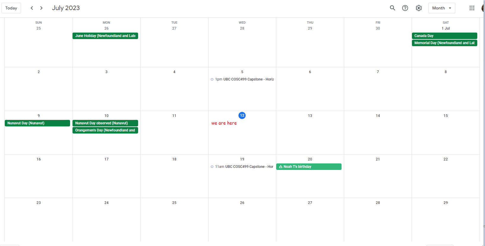
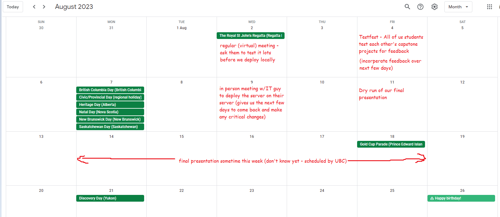
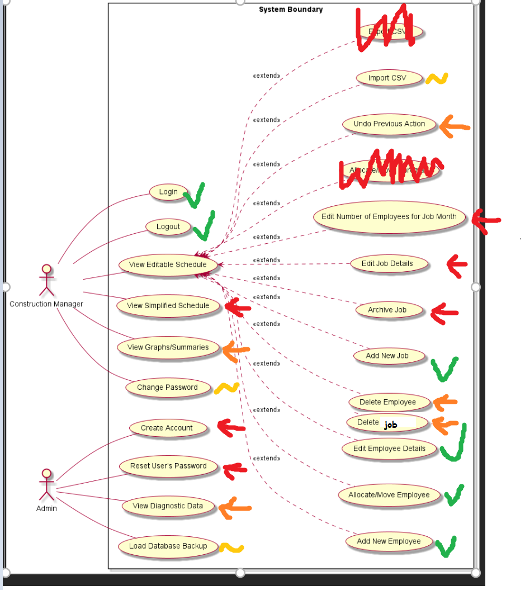

#### FYI - I count going past midnight as the same day, so hours on a day on clockify might not match this log
#### Also - Reviewing a PR means not only testing to see if it works correctly, but also a proper code review

# Thurs Aug 17th
#### overall time spent: 6h
- Rehersed the presentation slides one last time
- final presentation! Overall it went pretty good, and there was also a ton of other cool projects
- Peer evals
- update logs one last time

# Wed Aug 16th
#### overall time spent: 8.5h
- Wrote a bunch of emails to the client for fixing the server issue (there were multiple issues, once we got it fixed on our end (had to rebuild containers), I cc'ed Martin (IT Guy) in an email and he got it fixed on their end, he didn't say what he did to fix it though)
- Attended Scott's requirements meeting (we got 18.125/15 wohoo!)
- Worked with Edwin to make the 2min demo for the presentation (we both worked on script, i did video, he did audio + a little editing)
- We all rehersed the presentation and made a bunch of changes (i completely reworked the wording on my slides haha, got it in a pretty good spot though I think)

# Tues Aug 15th
#### overall time spent: 12h (overflow into next day)
- merged in some PRs and updated the deployment branch + client fork
- fixed a bug regarding to inactive/in school on job page not always updating (was an asynch issue, had to change change_active())
- wrote an email to client about getting them to sync the new changes
- update personal logs
- A frickload more final documentation. Parts i did:
    - Made sure use case diagram was updated
    - Prioritised the use cases (we will roughly follow these priorities for documenting them since we won't have enough time to document them all)
    - Helped make a guide for how the use case documentation should be with an example
    - Updated the requirements (plus reviewed them with a check or X) + added some new SMART ones
    - Documented some of the most critical parts and functions of our system (Important Implementation Notes & Global Functions, plus the common ajax functions in the first use case (view job page))
    - Wrote detailed use case documentation for add job, edit projection number, and view job page
    - listed technical dependencies
    - Added some MVC diagrams from my 360 textbook (with citation)
    - Known bugs section
    - Lessons Learned section
    - Almost the entire projection continuation guide (workflow,testing, deployment environment, installation details, tests needed, and potential new features. Yuan did the help page screenshots for the user guide)
    - Other smaller stuff: tossed in user personas, arch diagram, DFDs I think, updated yuan's WBS, clockify screenshots, github stats, kanban board, burnup chart, etc.

# Mon Aug 14th
#### overall time spent: 7h
- Review PR # 361 (even more tests), PR # 362 (help tab fixes), PR # 359 (client requested changes)
- Made a lot of fixes in client requested changes (fixed edit/save button interfering with other overlays due to using same id, fixed meeting/deficit/surplus for outlooks, more) 
- fixed drone again
- more final documentation
- made a cute little about tab on login
- wrote another email to client regarding putting inactive/in school on the job page

# Sun Aug 13th
#### overall time spent: 0.5h
- just discussed a bit regarding final docs

# Sat Aug 12th
#### overall time spent: 4.5h
- updated usecase diagram again
- Made a prioritised list of use cases/features (mostly to act as a list for what needs to documented first in case we don't have enough time)
- Worked on final documentation (documented a bunch of the global functions, got edit outlook done (use case description, sequence diagram, implementation description))

# Fri Aug 11th
#### overall time spent: 8h
- Practice presentation with scott, got a lot of great feedback.
- More work on history page
    - made ranges work
    - Refactored the two job-details to make only one 
    - added unarchive job (front end, backend, tests)
    - Worked with edwin to get pages working (jobs per page, prev/next page) - done since showing all jobs per page was very laggy
 - Added some new issues
 - Wrote email to client regarding how hard the changes they requested will be to make
 - Reviewed PR #355 (batch assign fixes), PR #346 (projector number indicator), PR #356 (fix tests + new tests)
 - Added some cool search highlighting on all searches by using a regex to add <mark> tags around search term
 - Peer Evals

# Thurs Aug 10th
#### overall time spent: 9h
- Wrote an email to our client regarding updating them of a new help tab we added (using a "sync project" file in project folder that runs git pull), a task list of things we would like them to do to learn the system, and a survey for feedback
- Updated the usecase and architecture diagrams a few more times (minor additions)
- Updated the issues a bit
- Worked on the presentation (4h)
- Updated personal log
- Made report

# Wed Aug 9th
#### overall time spent: 8h
- Scott class deliverables meeting
- Helped get the repo ready for deployment (create a client fork and a deployment branch, getting rid of dummy data, changing the SQL user for the database to be not root (edwin did this one), etc.)
- Reviewed PR #337 change username
- Successfully deployed the server! (4.5h) Quick summary:
    - First step was to set them up with a github account and invited them to the client repo. We then pulled our project onto the system
    - Next was to install docker, this did not work initially and we had to enable CPU virtualization in the server's BIOS (with troubleshooting involved)
    - Once docker was installed, we booted up the system but ran into some temporary issues where the server could not download the docker images for whatever reason
    - Once that fixed itself, we booted up the server which was successfully accessible from their computers!
    - We then ran into multiple issues with importing the jobs and employee csv not working correctly (some issues were from silly code errors, others were from bad data format given). Eddy, Jordan, Edwin, and I all worked together to try to fix it. We eventually settled with it mostly importing everything and then just manually doing the last few.

# Tues Aug 8th
#### overall time spent: 7h
- Updated the architecture diagram to add on some deployment details and to make it more accurate overall (in final docs)
- Discussed getting continues deployment set up and the new arch diagram
- Started Reviewing PR #355 - backup fix
- Reviewed PR #336 - Duplicate employee
- Got more done on the history screen
    - Refactored get graph data function so that they work with a start range and an end range
    - Some styling changes to make the archived jobs a different colour and the graphs to make them fit a little better
    - Made the "actual" and "outlook" legend only show on the top job, with the x-axis labels only showing on the bottom job (it looks pretty slick now i'd say haha)
    - Added an "All Jobs?" toggler to toggle showing the graphs for all jobs vs only archived jobs
- Updated personal logs
- Made Report

# Mon Aug 7th
#### overall time spent: 7h
- Reviewed PR #331 (lots o fixes). It refactored a major function (closeOverlay()) to prevent it from refreshing the page multiple times, which required some effort to adjust so it would not break everything (easiest solution was to add a global variable flag on only pages where we don't want to do the refresh on closing the last overlay (admin functions))
- Gave yuan some feedback on the documentation/help page branch
- Made more progress with developing history page (was mostly fumbling around with javascript being a pain in the ass lol, though it should be smoother sailing from here on out)
- discussed the newly merged branches plus priorities moving forward

# Sat Aug 5th
#### overall time spent: 5.5h
- Discussed some ideas on how history page will look and its features
- Reviewed PR # 325 (required field astrix), PR #326 (Employee Edit Status), PR #327 (Fix mass remove ending assignments), PR #328 (stop XSS injection), and PR #330 (Fix pin employee and batch assign weirdness)
- Started to investigate load backup a little. Turns out pdo doesn't like the START DELIMITER statements that the mysqldumps have been creating around the triggers on the new backups. Eddy might go with doing php exec() instead
- Made a rough guide on how the description of implementation should look like

# Fri Aug 4th
#### overall time spent: 10.5h
- Updated some more stuff for test o rama
- Did test o rama! Got to try out a handful of other people's projects and we got a lot of great feedback which was awesome! Turns out our loadbackup functionality wasn't working either, which wasn't ideal but oh so much better to find out now than later haha
- Made some new issues from the test-o-rama (edwin also made a bunch)
- Made archive job (tests + backend + frontend)
- Made delete job (tests + backend + frontend)
- Got started on the history page, mostly tried to research if there were more efficient ways to get the data into the graphs
- Peer Evals 

# Thurs Aug 3rd
#### overall time spent: 8.5h
- Did a bunch of testorama stuff
    - Took edwin's list of tasks to do and re-orgainised it and designed it so they would reset the database after each test (added/removed a bunch of steps too)
    - Made a testorama document to be printed off during for the event (yuan said she will print them off)
    - Discussed the plan for it
- Did a lot more changes to PR #274 (job details overlay)
    - refactored getting the graph data out of the file that generated the overlay, allowing the graph to be called on its own (i.e. after an edit to the job, can refresh the graph)
    - Changed the start and end ranges to always include the start and end date of a job as well as today (was suprisingly complicated)
    - Added some client-side validation. It still doesn't look super pretty but it works
    - Some fixes for firefox/safari not liking the month input type
- Reviewed all of PR #274 (we had a few people working on it) and dealt with a biggish merge conflict
- Personal logs
- Create Report
- Review PR #283 Projector View

# Wed Aug 2nd
#### overall time spent: 9h
- Client meeting
    - They shown us that the computer that would be running the server is within their server room, so it should be secure. This means we don't need to worry about the hyper-V stuff
    - They also mentioned the computer is connected to wifi, so we'll be able to clone it right off of github
    - We got to see what our website looks like on their big TV and got some minor styling feedback
    - We said it can take as little as 1 hour but at most 2.5 hours, and they said they don't want to go later than 4:30pm (for reference we're starting at 1)
- Discussed the client feedback we got regarding styling the projections
- Reviewed PR #272/273 (gif docs vs image docs) a little and chose that the gif one would be a better
- Reviewed PR #276 (edwin's styling)
- Reviewed PR #284 (more styling stuff), reverted some stuff off of master that should not have been pushed
- Reviewed PR #258 (importcsv), made some bug fixes to it and refactored some things. Still needs a couple things
- added and organised issues
- Started reviewing PR #274 (job details overlay) and started working on improving it
    -  made start date and end date months
    -  refactored add job's client-side validation and seperated it, allowing it to be used in edit job details
    -  added better error checking onto add job and edit job employee
    -  made some query optimizations
    -  moved job details stuff into their own folder

# Tues Aug 1st
#### overall time spent: 4.25h
- Updated the use case diagram into a usecase flowchart (it's huge and awesome now)
- Updated personal logs
- Created report

# Mon July 30th
#### overall time spent: 2.5h
- Finished reviewing PR #256
- Reviewed PR #263, 264

# Sat July 29th
#### overall time spent: 6h
- Wrote emails to the client regarding the contract (whether we can still show the project to employers) and one to the IT guy about how we asked scott about having docker running within a hyper-V VM and that it should be fine. He replied once again suggesting we put it on a separate computer again so I am confused
- Reviewed PR #260 (Account screen). Made a lot of changes and bugfixes to it, made unarchiving give a more helpful message, added some new error checking to file upload, styling improvements, and fixed a bug causing drone tests to fail (plus added dummy data from our presentation branch that we missed)
- Starting reviewing PR #258 (import csv), though eddy is still working on it
- Added some new issues to kanban board

# Fri July 28th
#### overall time spent: 4h
- Meeting with Scott + After Meeting Discussion
- Started reviewing PR #260, 256
- Reviewed PR #255, 254

# Thrus July 27th
#### overall time spent: 4h
- Read over contract
- Finished making the crazy query
- Update personal logs
- create report

#### I Present: The Query
```SQL
-- used to get a table that gives every date from start date to end date
WITH RECURSIVE cte AS (
    -- customize start date here (currently starting from today - 1 year)
    SELECT DATE_SUB(CURDATE(), INTERVAL 1 YEAR) AS idate
    UNION ALL
    SELECT DATE_ADD(idate, INTERVAL 1 day) AS idate FROM cte 
    -- customize end date here (currently finishing at today + 1 year)
    WHERE DATE_ADD(idate, INTERVAL 1 day) <= DATE_ADD(CURDATE(), INTERVAL 1 YEAR)
)

SELECT job.title, 
idate,
IF(idate > CURDATE(), NULL, COUNT(employee_id)) AS actual_emp_count, 
IFNULL(outlook.count, 0) AS predicted_emp_count, 
IF(COUNT(employee_id) >= IFNULL(outlook.count, 0), TRUE, FALSE) AS isOver, 
IF(job.start_date IS NULL, NULL, IF(EXTRACT(YEAR_MONTH FROM idate) < EXTRACT(YEAR_MONTH FROM job.start_date), TRUE, FALSE)) AS isBeforeStart, 
IF(job.end_date IS NULL, NULL, IF(EXTRACT(YEAR_MONTH FROM idate) > EXTRACT(YEAR_MONTH FROM job.end_date), TRUE, FALSE)) AS isAfterEnd, 
IF(idate = CURDATE(),TRUE, FALSE) AS isNow
-- cte cross join job is basically the base table where every job gets every day attached to it
FROM cte CROSS JOIN job 
-- join outlook on only where the job_ids match and the months match (this should create a functional dependency, but CTEs don't have primary keys so mysql can't figure it out) 
LEFT OUTER JOIN outlook ON (job.id = outlook.job_id AND EXTRACT(YEAR_MONTH FROM idate) = EXTRACT(YEAR_MONTH FROM outlook.date))
-- for the assignment to be joined, it must start after idate and before end date (or if assignments.end_date is null) 
LEFT OUTER JOIN assignments ON (assignments.job_id = job.id AND idate >= assignments.start_date AND IF(assignments.end_date IS NULL, TRUE, idate <= assignments.end_date))
-- only really grouping by id and idate, outlook.count has a functional dependency but mysql can't see that
GROUP BY id, idate, outlook.count
ORDER BY id ASC, idate ASC
```

# Wed July 26th
#### overall time spent: 3.5h
- TA meeting
- After meeting discussions on what still needs to be done (delete emp and job, archive emp and job, superintendent, more) and how
- Started making a crazy query that will be used for charts with the following columns (jobid (can be set to a specific job), day (YYYY-MM-DD), actual_emp_count, predicted_emp_count, isOver (if actual > predicted), isBeforeStart, isAfterEnd, isNow)

# Tues July 25th
#### overall time spent: 4h
- Finished writing email for IT guy
- Reviewed PR #248, #244 more (both are basically ready to merge, just waiting on drone)
- Started Reviewing PR #245. It was accidentally merged into master without a code review and it unfortunately reverted some changes from other branches, so I had reverted the branch for now
- Updated personal logs
- made report

# Mon July 24th
#### overall time spent: 2.5h
- Started reviewing PR #244 (auto-refresh), including bug fixes, new comments, and adding a countdown timer

# Sat July 22nd
#### overall time spent: 0.5h
- Started writing an email reply to the IT guy mentioning the problems with having docker run within Hyper-V

# Friday July 21st
#### overall time spent: 4.75h
- Meeting with TA, discussed how to go forward with talking with the IT guy
- Finished reviewing PR #136, #241, #235, #214, and load backup -> all of which got merged
- discussed some button styling and how to do asynch updates with jordan and edwin
- Peer evals

# Thurs July 20th
#### overall time spent: 6.5h
- Wrote email to IT guy regarding security issues with putting it on putting on a computer as opposed to their server. He agrees with me though now he wants to put it on a virtual machine using Hyper-V, and that seems unnecessary seeing as how we're already using docker
- Fixed, reorganised, and added new issues
- Reviewed PR #136 yet again, cleaned it up (removed images and backups, refactored it to use security functions, added a bunch of comments, and fixed a few bugs (including indicating that the server is processing an image))
- Starting reviewing PR # 214
- Updated personal logs
- Made Report

# Wed July 19th
#### overall time spent: 5.5h
- TA meeting
- Showed Jordan and Edwin the new styling in edit projection number and implemented a few suggestions
- Discussed Edit job and how to do the asynch updates with jordan
- Finished all the tests for edit projection number and got it merged!
- Reviewed Add job (PR #136 some more) and pointed out some more things for compressing images to below 10KB
- Collaborated with Edwin to fix the big merge conflict between edit projection number and admin view (took 1 hour, it was a very manual process)
- Discussed testing with edwin to see if there's a way to do phpunit without needing to refactor all SESSION, POST, and die() references within the function we want to test (he looked a lot into getting curl working, but unfortunately no luck)
- Reviewed PR #221


# Tues July 18th
#### overall time spent: 6.5h
- Had a meeting with the IT guy and our client
  - He wants to have our server on a separate computer in the office as opposed to their server, this might create some security issues that I discussed about and probably should write an email about
  - He also says he'll help us with firewall configurations and setting up a static IP
  - We're also cancelling our client meeting tomorrow since we had one today
- Reviewed PR #194 (huge, mostly since it deals with a lot of account stuff and did a lot of refactoring)
- Organised issues on kanban board - archived redundant ones and added a 'needs testing' column for the functions we don't have tests for yet
- Successfully figured out that it's possible to retrieve the actual employee counts for each day through our 'assignments' table using a recursive CTE -> still need to write it
- Updated personal logs
- Created Report

# Mon July 17th
#### overall time spent: 10h
- Reviewed PR #205 (big)
- Made a ton of progress with the Edit Projection Number use case
  - Completely remade and finished the backend function that yuan started for edit projection number
  - Made the javascript and front-end for it, though it might still need some styling tweaks (will show Edwin and Jordan after next meeting)
  - Added both client-side and server-side error checking for it
  - Refactored and Remade printing the projection numbers so that unchanged projection values can interweave with changed projection values. Also cleaned it up a lot to make it more easily maintainable 
  - Made the total employee counts asynchronous with ajax so they actually update when editing the projection numbers (Edwin did something similar in his branch, so we've got a big merge conflict inbound)
  - Got started with the backend tests for it, still gotta refactor it a bit
- Discussed plans for talking with the IT guy
- Added some new issues to the kanban board

# Sat July 15th
#### overall time spent: 1h
- Updated personal logs and did peer evals (forgot to do it on Friday whoops)

# Friday July 14th
#### overall time spent: 4h
- TA meeting
- Implemented changes from review for Add Job and finally got it merged!
- Reviewed PR #187 (small)
- Organised some issues on the kanban board
- Made a new branch to implement some small styling changes (having more than 35ish employees in a job will show a scrollbar. Also moved the actual employee count from the side to bottom)
- Discussed with Edwin about style sheet organisation and showcased to him add job

# Thurs July 13th
#### overall time spent: 4h
- Reviewed PR #136 more (still had some bugs, poor jordan), PR #186 (small), and PR #187 (large)
- Discussed some styling changes for the main buttons (where to put them, emphasis on more important ones)
- Updated Personal logs
- Created Report

# Wed July 12th
#### overall time spent: 4.5h
- Meeting with Scott
- Discussed a lot about deployment -specifically when we're going to deploy (Aug 9th) as well as what we need to send the Horizon's IT guy (we're gonna do a call) -2h
- Discussed undo again, gave off a bunch of cases that need undo and some cases that would be nice to have. Also mentioned that since undo requires such a massive architecture change (integrate a command pattern) with a lot of needed tests, it's probably not gonna happen
- Discussed what use cases we have done, what we absolutely need done, and what we should have done but less priority
- Made some minor fixes to the visual job dates
- Reviewed PR #160, #159 -0.5h/each (medium-sized)





# Tues July 11th
#### overall time spent: 8h
- Reviewed PR #136 more
- Finished styling add job, it now looks pretty presentable (error messages also show correctly). Also added a hint for inputting dates
- Fixed the start date on the job page always showing as today. 
- Added some visual indicators for the start and end date, as well as days after the end date on the outlook
- Jobs now show a better-formatted version of their start month and end month (plus will only show year if it's different than this year)
- Updated personal logs
- Make Report for Scott

# Mon July 10th
#### overall time spent: 0.5h
- Reviewed PR #136 more

# Sun July 9th
#### overall time spent: 0.5h
- Reviewed PR #169, #136 more

# Fri July 7th
#### overall time spent: 6.5h
- Meeting with TA
- Fixed the drone workflow (it started failing when the database was renamed)
- Made more progress on add job - connected it with the backend, though styling still needs a little work
- Discussed what details we should send our client's IT people
- Peer Evals

# Thurs July 6th
#### overall time spent: 10h
- Got some good progress converting my add job from using bootstrap to using the new styles (1.5h)
- Reviewed PR #136 (big one. employee picture upload. dealt with files)
- Discussed whether to do a warning message or have the modal save when it gets closed on accident
- Organised and made more tasks on the kanban board
- Went through and organised the categories of time of team members on clockify (10m)
- Researched how to get the form validation niceness of bootstrap without all the other stuff (2h) - no success so far
- Updated personal logs
- Reviewed PR #136 more, #160 (small), started #159 (big)
- Helped make the past 3 reports

# Wed July 5th
#### overall time spent: 4.5h
- Did MVP Presentation. I covered most of the process stuff
- Had another client meeting where we showed them our MVP. Got some good feedback regarding a few things. No big requirement changes
- Organised and made more tasks on the kanban board
- Reviewed PR #146 (small)
  
# Tuesday July 4th
#### overall time spent: 10h
- Filled my section of the new WBS
- Reviewed PR #131, #133 (both were large)
- After reviewing PR #131 (which was based on a feature branch whose PR wasn't merged yet), had discussions about trying to make feature branches off of the main branch, and if you do make a feature branch off of another feature branch, it will not get reviewed nor merged until original feature branch is updated (and you will need to merge any changes from the original feature branch into yours so you don't overwrite any new changes to the original)
- Also had discussions on how to fix branch mess
- Finished making the presentation (including a presentation branch with all our slightly unfinished features)
- Updated personal logs
- Discussed styling differences between bootstrap and the one Edwin chose
- Finished reviewing PR #129 and merged it
- Organised the kanban board tasks more
- Updated some of the requirements that were outdated (added stuff about branches into the process, also updated the projector stuff to TV) - haven't yet merged to main though

# Mon July 3rd
#### overall time spent: 4.5h
- Re-made the WBS to add more tasks and make them more detailed, added a separate columns for actual time spent on tasks, as well as added some more fun statistics to it like days remaining, % completed
- Started the presentation

# Sunday July 2nd
#### overall time spent: 2h
- Reviewed PR #130 and #129 (#129 is a big one)

# Friday June 30th
#### overall time spent: 4h
- Continued work on the add-job overlay to give it working client-side validation (at 200 lines worth so far)
- Updated personal logs and did peer evals

# Thurs June 29th
#### overall time spent: 3.5h
- Caught myself up on the status of the project and discussed task distribution and DB changes a little
- Reviewed PR #126, #128
- Started work on the front-end framework for the add-job overlay (issue #100). Also figured out bootstrap can still be used with the project

# Wed June 28th
#### overall time spent: 3.5h
- Got CI/CD working with drone! Now all tests will auto-run on PR and commit to PR. Took a lot of trial and error as there was poor online documentation for it

# Tues June 27th
#### overall time spent: 2h
- Reviewed PR #101, #104, #123

### -------------
### finishing COSC 360 project and final 
### -------------

# Friday June 23st
#### overall time spent: 0.5h
- Updated Personal logs and did peer reviews (didn't do a lot this week due to cosc360 project and final)

# Wed June 21st
#### overall time spent: 2.5h
- Meeting with Scott
- Tried Scott's PHPUnit example - got working the next day
- Had a productive client meeting, got some things sorted out. They seem overall pretty happy with the progress so far which is good
- Tried to help Yuan get docker set up on her mac. Managed to get through a few errors but got stuck on this linux version issue
- Tried out DroneCI to see how it works - still need to incorporate running the tests automatically

# Tues June 20th
#### overall time spent: 1.5h
- Shared Scott's phpunitdocker thingo with the rest of the group
- Made the Report (1h) - took a little bit longer since the done list was a little unorganised 
- Updated personal logs

# Mon June 19th
#### overall time spent: 1.5h
- Reviewed some more pull requests and gave feedback
- Discussed ideas around how passwords should initially be set when accounts are first created (1h) 

# Sat June 17th
#### overall time spent: 1.5h
- Reviewed some more pull requests and gave feedback

# Friday June 16th
#### overall time spent: 1.5h
- Peer Evals and Meeting with Scott (1h)
- Clarified what the categories of time is on clockify + other discussions

# Thurs June 15th
#### overall time spent: 2.5h
- Reviewed a couple pull requests (1h)
- Researched more into an undo feature (1h), thinking about doing a command pattern with a stack of commands stored on the server
- updated personal logs and edited biweekly report

# Wed June 14th
#### overall time spent: 2.5h
- Had team meeting with scott (0.5h)
- Assigned t-shirt sizes onto most of the tasks on the kanban board (while consulting team members)
- Discussed how undo would work, some progress was made
- Tried to start using CI/CD with drone, but suffering authentication issues - ROADBLOCK

# Tuesday June 13th
#### overall time spent: 2h
- Created new tasks and and filling out the todo board
- Disccussed CSS techs
- updated personal logs
- Created Report for tommorow
- Made new catagories on clockify to classify our time

# Monday June 12th
#### overall time spent: 3h
- Made most of the backend for login
- Spent time trying to get phpunit working on docker, no luck so far but Scott offered help

# Friday June 9th
#### overall time spent: 5h
- Participated in class for the design presentations
- took some steps to set up our project with docker to start implementing
- more logs!
- peer reviews


# Thurs June 8th
#### overall time spent: 7h
- Created two personas, a technologically-challanged construction manager (primary user group) and a IT guy as someone who might get called in to do work on our system (3h total, mostly spent on the manager)
- Contributed to creating the presentation by adding slides for the personas, the use cases, and the architecture diagram (which are the slides I ended up rehersing and presenting)
- Took a little bit of time to fix the file structure of our repo to add the missing src, test, and tools folders (wanted to get done before implementation)
- Helped a bit with the details of the test plan and other parts of the design
- Fixed the use case for login to have more accurate extensions (there's a lot more now)
- Submitted the final documents and presentation

# Wed June 7th
#### overall time spent: 2h
- Participated in group meeting with scott to go over our design document draft
- Had a group meeting with our client to go over several questions I had gathered as well as for feedback for Edwin's UI
- Discussed with the team for a brief moment after our client meeting regarding some design issues 
- Tried to help organize the group to clarify everything that needs to be done before the presentation

-- new week --

# Sun June 4th
#### overall time spent: 2h (more details on clockify)
- updated user reqs
- discussed how accounts should be made
  - decided that the admin should first be logged in to create a new account (who will then be prompted to create a new password)
  - updated use case diagram
- helped final submission for the second milestone (final scope n charter and draft design)
- started personal logs
  - everything below is a bit hazy

# Sat June 3rd
#### overall time spent: 1h
- helped Jordan a bit with the DFD
  - still need input from scott on how to continue, since more detailed DFD will be massive
- helped Eddy a bit with the sequence diagrams

# Fri Jun 2nd
#### overall time spent: 4h
- helped Jordan with the ER design
- participated in meeting with scott and team
- did some more work on the scope & charter
  - expanded details on some functional requirements
  - expanded on data requirements (in non-functional)
- created a detailed sequence diagram using plantUML for login
  - improved it later in the day with good feedback from team members
  - one of the goals of it was to show how one could create a sequence diagram using plantUML in case the other team members wanted to use it for the other sequence diagrams
- made adjustments to the use case diagram to account for admin user and use cases

# Thurs Jun 1st
#### overall time spent: 1.5h
- created an architecture diagram
- more improvements to the scope and charter document
  - I don't remember what I did and I don't have an effective way of checking thanks to word's poor way of checking a document's history
  - what I do remember is that at this point, I had written and changed nearly all of the requirements. The following is a summary of all the changes I had made since the 29th:
    - Number of Func reqs: 6 -> 16 (all previous reqs were removed/changed)
    - Number of Non-func reqs: 4 -> 20ish (all previous reqs were removed/changed)
    - Number of Technical reqs: 3 -> 4 (1 was left unchanged)
    - Number of User reqs: 2 -> 15 (all previous reqs were removed/changed)
    - Description of Workflow: 84 words -> 209 words
    - Number of Assumptions: 7 -> 11 (a few were left unchanged)
    - Constraints: 2 -> 3 (one left unchanged)
    - Created use case diagram
    - Created one use case description, login, which other members could follow
    - A handful of other, less important changes


# Wed May 31st
#### overall time spent: 3.5h
- made a lot more changes and improvements to the scope and charter document
  - see comment for June 1st above

# Mon May 29th
#### overall time spent: 9h
- attended first project meeting with the client
  - adamantly listened the whole time and asked a handful of questions
    - props to jordan though for leading most of the discussion and questions
  - received a free lunch which was cool
- updated the use case diagram with the cases that the client mentioned
- spent nearly 7 hours on the scope and charter, adding a lot of information (see june 1st summary)

# Mon May 29th
#### overall time spent: 1.5h
- got started with the use case diagram with cases I was certain about (which was not that many, we had not met with our client yet)
- made some starting changes to the scope and charter with what we were more certain about 


and that's all folks!
